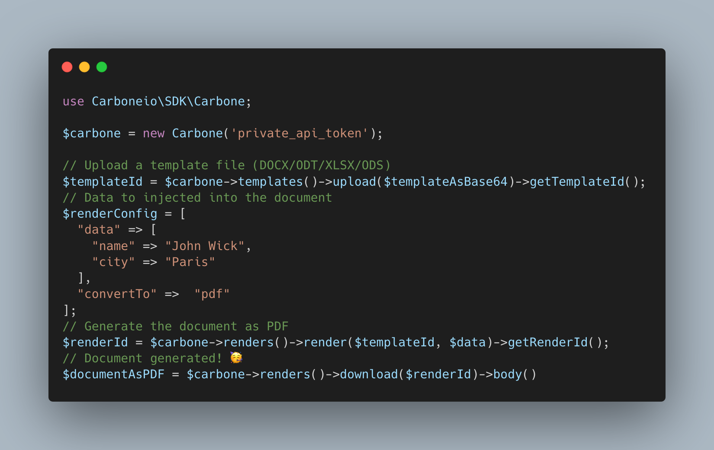

# Carbone PHP SDK

This package provides a PHP SDK for the [Carbone.io](https://carbone.io) Cloud API.



## About Carbone

Carbone is a powerful and easy to use API to generate documents from a template to a PDF. It is based on LibreOffice and can convert any document supported by LibreOffice. It is also possible to convert HTML to PDF. Learn more about [supported files and features](https://carbone.io/documentation.html#supported-files-and-features-list).

## Installation

You can install the bindings via [Composer](http://getcomposer.org/). Run the following command:

```bash
composer require carboneio/carbone-sdk-php
```

## Usage

### Carbone instance

Using the SDK is very easy. You just need to create a new instance of the Carbone class and provide your API key. Get your API key on your Carbone account: https://account.carbone.io/.

```php
use Carboneio\SDK\Carbone;

$carbone = new Carbone('YOUR_API_KEY', 'https://api.carbone.io/');
```

### Upload a template

You can upload a template to Carbone using the `upload` method. This method takes the content of the template as base64. The method returns a `template ID` used to [generate documents](#render-a-template).

```php
$response = $carbone->templates()->upload($contentBase64);

$templateId = $response->getTemplateId();
```

You can also specify the conservation time for this template. By default, the template will not be deleted in production (30 days in test mode). You can set the conservation time in seconds using the `carbone-template-delete-after` header like this :

```php
$response = $carbone->templates()->upload($contentBase64, [
    'carbone-template-delete-after' => 86400, // 86400s = 1 day
]);

$templateId = $response->getTemplateId();
```

> See [Carbone API documentation](https://carbone.io/documentation/developer/http-api/introduction.html#template-storage) for more information about template storage.

Example to [upload a template](./examples/upload_template.php)

### Render a template

You can generate a document using the `render` method. This method takes the `template Id` and the data as parameters. A `render ID` is returned and must be used to [download the generated document](#download-a-rendered-template).

```php
$response = $carbone->renders()->render($templateId, $data);

$renderId = $response->getRenderId();
```

In case of asynchronous rendering process, you can specify a webhook URL to be notified when the rendering is finished.
The webhook URL will receive a POST request with the `success`  and the `render ID` in the body.

You can also specify custom headers for the webhook request, like authentication, using the `carbone-webhook-header-X` header. The `X` can be replaced by any custom header name.

```php
// use a simple webhook URL
$response = $carbone->renders()->render($templateId, $data, [
    'carbone-webhook-url' => 'https://my-server.com/webhook',
]);

// use a webhook URL with custom headers
$response = $carbone->renders()->render($templateId, $data, [
    'carbone-webhook-url' => 'https://my-server.com/webhook',
    // this will be sent as `Authorization: my-token` in the webhook request
    'carbone-webhook-header-authorization' => 'my-token',
]);

$renderId = $response->getRenderId();
```

> See [Carbone API documentation](https://carbone.io/documentation/developer/http-api/introduction.html#api-webhook) for more information about webhooks.

Example to [download a rendered document](./examples/download_report.php)

### Render and directly download a rendered template

You can render and download a render in the same request using the `renderAndDownload` method. This method takes the `template ID`  and render data as parameters.

```php
$templateId = "your_template_id";
$data = [
  'name' => 'John Doe',
  'age' => 30,
];

$response = $carbone->renders()->renderAndDownload($templateId, $data);

// Save the contents of the file yourself on your filesystem
$content = $response->getContent();
```
Example to [render and download a document](./examples/render_and_download_report.php)

### Delete a template

You can delete a template using the `delete` method. This method takes the `template Id` as a parameter.

```php
$response = $carbone->templates()->delete($templateId);
```

Example to [delete a template](./examples/delete_template.php)

### Download a template

You can download a template using the `download` method. This method takes the `template Id` as a parameter.

```php
$response = $carbone->templates()->download($templateId);
```
Example to [download a template](./examples/download_template.php)

### Add custom headers

Set custom headers, such as "carbone-version" to select a specific [Carbone version](https://carbone.io/api-reference.html#api-version). By default, the SDK request the version 4 of Carbone.

```php
$carbone->setHeaders([
  "carbone-version" => 4,
  /** Uncomment to delete automatically templates after a specific time */
  // "carbone-template-delete-after" => 86400, // 86400s = 1 day | https://carbone.io/api-reference.html#template-storage
  // "carbone-webhook-url" => "https://my-server", // https://carbone.io/api-reference.html#api-webhook
]);
```

> **Note:** custom headers applied this way will affect all requests made by this instance of the Carbone class. If you want to set custom headers for a specific request, you can do it by passing the headers as an array in `Upload a template` and `Render a template
` requests. 

### Get API Status

```php
$response = $carbone->getStatus();
$json = $response->json();

echo "Status : " . $response->status() . "\n";
echo "Success: " . $json['success'] . "\n";
echo "Version: " . $json['version'] . "\n";
echo "Message: " . $json['message'] . "\n";
```

## 🧪 Run tests

First install required composer packages:
```bash
composer install
```

Then execute tests:
```bash
composer test
```

## 👤 History

The package was originaly made by [MadeByBob](https://github.com/madebybob) and open-sourced the code. The Carbone.io team is now maintaining the SDK and will bring all futur evolutions.<br>
Original repository:https://github.com/madebybob/carbone-sdk<br>
MadeByBob website: https://madebybob.nl/

## 🤝 Contributing

Contributions, issues and feature requests are welcome!

Feel free to check [issues page](https://github.com/carboneio/carbone-sdk-php/issues).

## Show your support

Give a ⭐️ if this project helped you!
